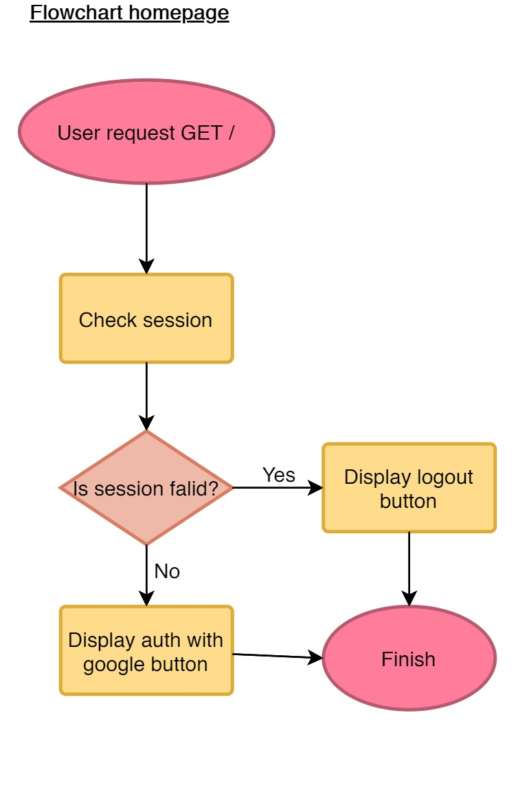
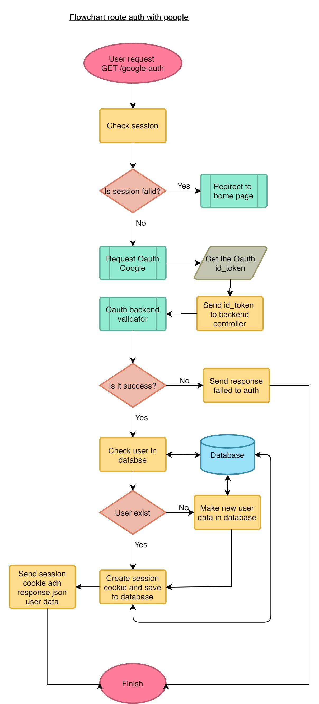
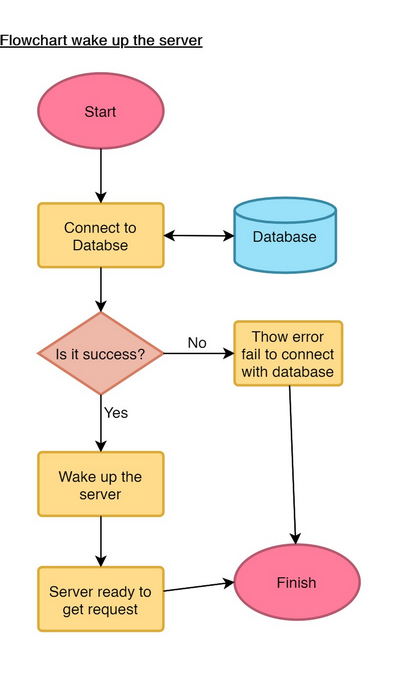
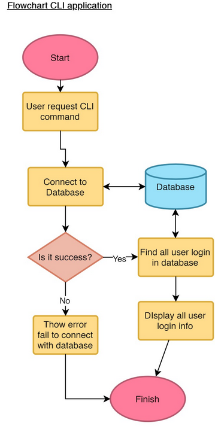

# refactory-assignment
Created by: M. Abyan Rizqo
<br><br>
This repo is the part of Refactory Intensive Probation Assignment for Backend Learning Part.<br>
## 1. Logic Test Problem
I use python for this test. Logic test contain in *__logic_test__* folder. Every probelm covered by diverent file.
* *fibonacci.py* cover Fibonacci problem
* *fizzbuzz.py* cover FizzBuzz problem
* *leapyear.py* cover Leap Year problem
* *palindrome.py* cover Palindrome problem
* *reversewords.py* cover Reverse Words problem
## 2. JSON Manipulation Problem
I use javasript for this test. JSON manipulation contain in *__json_manipulation__* folder. 
JSON data contain in *inventories.js*.  Every problem covered in *json_manipulation.js*. Description of every function: 
1. *findMeetingRoomItems* cover "Find items in the Meeting Room" problem.
2. *findElectronicDevices* cover "Find all electronic devices" problem.
3. *findFurnitures* cover "Find all the furniture" problem.
4. *findByDate cover* "Find all items were purchased on 16 Januari 2020" problem.
5. *findBrownColors* cover "Find all items with brown color" problem.
## 3. Backend Problem
I use javascript for this test. For easy testing, frontend part also covered but only in a simple way. 
User data responses will be send in JSON format rather than html views.<br>
Plase set following env variable before run the server:
```
MONGODB_URI
GOOGLE_CLIENTID
GOOGLE_CLIENT_SECRET
PORT
SESSION_SECRET
SESSION_MAXAGE
```
### 3.1 Authentication with Google
#### Homepage
#####  Homepage Request <br>
 `GET /` <br>
#####  Homepage Response <br>
 Homepage view. 
Logout button will appear if session cookie valid (if not login with google button will appear)<br>
#####  Homepage Flowchart <br>

#### OAuth Google
##### OAuth Request <br>
 `GET /google-auth/` Will get the homepage view <br>
##### OAuth Response <br>
```
{
  "_id": "61******93329901c6ba0",
  "name": "M. Abyan Rizqo",
  "email": "r*****@**ail.com",
  "lastLogin": "2021-10-15T00:40:59.387Z",
  "createdAt": "2021-10-15T00:40:59.409Z",
  "updatedAt": "2021-10-15T00:40:59.409Z",
  "__v": 0
}
```

#####  Oauth Flowchart <br>

#### Server
#####  Server Flowchart <br>

### 3.2 CLI Application
CLI Applcation can get all users login info.<br>
#### Instalation
To install globally in your local computer run this command from base repository folder:

    npm i -g ./backend/bin
### Run the CLI App
After instalation, you can run the app by call:<br>

    refactory-assignment glu
this is equal to:<br>

    refactory-assignment get-login-users
If you wont install it globally, you can run this command command from base repository folder:

    node ./backend/bin get-login-users
Response of that request is:
```
List of login users:
-  r****@**il.com
-  a****@g**il.com
------------------------
```
or
```
Currently there is no user login

```
### Flowchart

